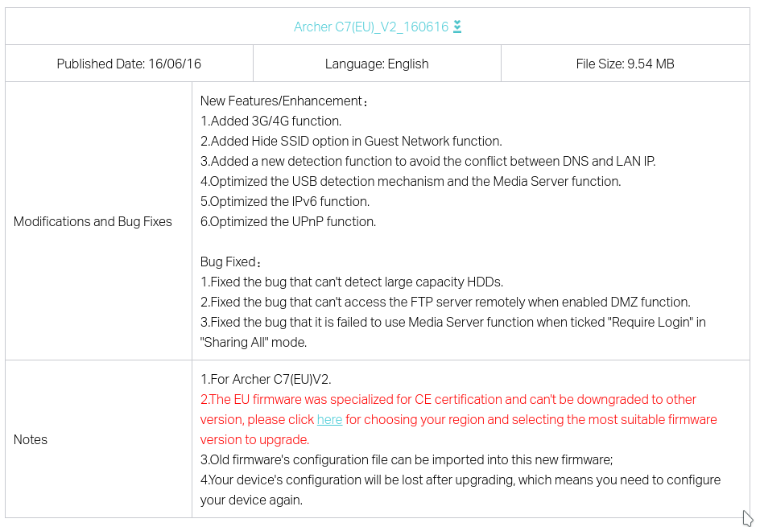
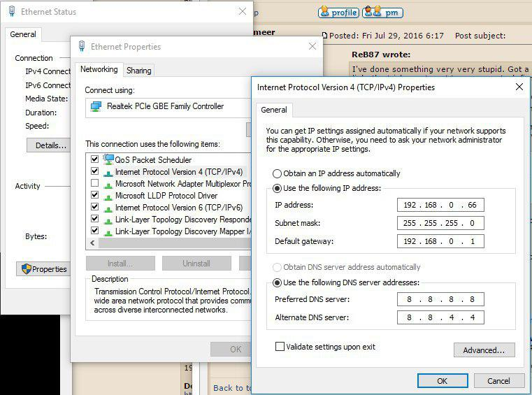
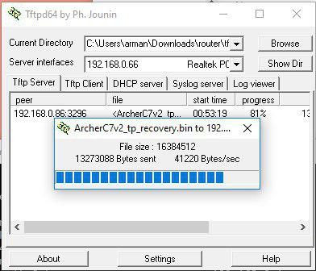
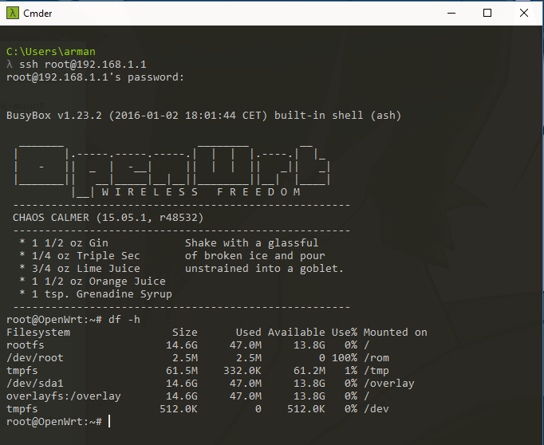

# AC1750 v2

## Introduction

So I bought this router from Amazon because is full-compatible with OpenWRT. You know that is v2 because of the sticker of the router, it says something like:
```
ver: 2.0
```
On the top-right corner of the sticker.

So the first thing I did was update the firmware.

__Please do not update the firmware__



It says in the official page that it's locked, it won't let you flash OpenWRT or any custom firmware, so what should we do now?

## Escaping the matrix I

The upgrading page of the router says error 18005 in every firmware that I tried to flash but there's another flashing methoud using tftp, so let's try it!.



First of all we must set our IP to 192.168.0.66, that's the IP in which the router will search for the firmware.

Then we can open a tftp server on our pc using [this link](http://tftpd32.jounin.net/tftpd32_download.html) for instance but you can use whatever you want.

We set the firmware name to:
```
ArcherC7v2_tp_recovery.bin
```

And we can try to flash it shutting off the router and starting it while pressing the WPS/reset button. It'll search for an tftp server and will found ours so it'll download the image and flash it.



## Escaping the matrix II

Now that we are in a previous version of the firmware which it's not locked we can flash OpenWRT as always, using the web interface.

## Upgrading the matrix

Now we'll run out of space pretty soon because of the limited memory of the router, the answer might be using a external usb as storage to gain more free space.

```bash
opkg install kmod-usb-storage kmod-scsi-core kmod-fs-msdos kmod-fs-vfat block-mount usbutils kmod-usb-core kmod-usb2 file kmod-nls-iso8859-1 kmod-nls-cp437 kmod-fs-ext4
```
With the previous packages we can see now /dev/sda1 and mount it

```bash
mkdir /mnt/sda1
mount /dev/sda1 /mnt/sda1

df
Filesystem           1K-blocks      Used Available Use% Mounted on
rootfs                   12544      4956      7588  40% /
/dev/root                 2560      2560         0 100% /rom
tmpfs                    63020       332     62688   1% /tmp
/dev/mtdblock3           12544      4956      7588  40% /overlay
overlayfs:/overlay       12544      4956      7588  40% /
tmpfs                      512         0       512   0% /dev
/dev/sda1             15318416     38144  14482424   0% /mnt/sda1
```

Checking the mount command

```bash
# Prepare external storage root
mount /dev/sda1 /mnt ; tar -C /overlay -cvf - . | tar -C /mnt -xf - ; umount /mnt

# Create fstab
block detect > /etc/config/fstab; \
   sed -i s/option$'\t'enabled$'\t'\'0\'/option$'\t'enabled$'\t'\'1\'/ /etc/config/fstab; \
   sed -i s#/mnt/sda1#/overlay# /etc/config/fstab; \
   cat /etc/config/fstab;

reboot
```



## Installing things

```bash
opkg install nmap tcpdump python python-pip screen zsh curl ca-certificates wget git-http nano node openssh-sftp-server iperf
echo $TERM
# Cygwin terminal can cause problems
export TERM=xterm-256color
sh -c "$(curl -fsSL https://raw.githubusercontent.com/robbyrussell/oh-my-zsh/master/tools/install.sh)"
```

### Screen

To create a new screen with the name foo, use

```bash
screen -S foo
```

Then to reattach it, run

```bash
screen -r foo  # or use -x, as in
screen -x foo  # for "Multi display mode" (see the man page)
# Delete session
 screen -X -S <id> quit
```

###  DHCP and DNS

To see the leases we can do it through the web or by doing:
```bash
cat /tmp/dhcp.leases
cat /tmp/resolv.conf.auto # See DNS

uci set system.@system[0].hostname=router
uci commit
```
We can setup hostnames and IPs using the web interface

Normal DHCP behaviour is this:
1. Lease is given a lease time perhaps 7days.
2. Client machine starts requesting a new lease half way through the current lease period.
3. Client machine only stops using the IP address when it either gets a new lease from the same DHCP server or the lease has expired.

### OpenVPN

We want a bridge-network so let's go for it:

```bash
# Setup keys
opkg install openvpn-openssl openvpn-easy-rsa luci-app-openvpn
build-ca
build-dh # Takes time, soo many time...
build-key-server my-server
build-key-pkcs12 my-client

cp /etc/easy-rsa/keys/ca.crt /etc/easy-rsa/keys/my-server.* /etc/easy-rsa/keys/dh2048.pem /etc/openvpn
scp /etc/easy-rsa/keys/ca.crt /etc/easy-rsa/keys/my-client.* root@CLIENT_IP_ADDRESS:/etc/openvpn
```
Configuring network

```bash
# Creating vpn0 interface
uci set network.vpn0=interface
uci set network.vpn0.ifname=tap0
uci set network.vpn0.proto=none
uci set network.vpn0.auto=1
# Lan bridge
uci set network.lan.ifname="$(uci get network.lan.ifname) tap0"
# VPN Rule
uci set firewall.Allow_OpenVPN_Inbound=rule
uci set firewall.Allow_OpenVPN_Inbound.target=ACCEPT
uci set firewall.Allow_OpenVPN_Inbound.src=*
uci set firewall.Allow_OpenVPN_Inbound.proto=udp
uci set firewall.Allow_OpenVPN_Inbound.dest_port=1194
# Commit
uci commit network
/etc/init.d/network reload
uci commit firewall
/etc/init.d/firewall reload
```
Now Configure VPN

```bash
echo > /etc/config/openvpn # clear the openvpn uci config
uci set openvpn.myvpn=openvpn
uci set openvpn.myvpn.enabled=1
uci set openvpn.myvpn.verb=3
uci set openvpn.myvpn.proto=udp
uci set openvpn.myvpn.port=1194
uci set openvpn.myvpn.dev=tap
uci set openvpn.myvpn.mode=server
uci set openvpn.myvpn.tls_server=1
uci add_list openvpn.myvpn.push='route-gateway dhcp'
uci set openvpn.myvpn.keepalive='10 120'
uci set openvpn.myvpn.ca=/etc/openvpn/ca.crt
uci set openvpn.myvpn.cert=/etc/openvpn/my-server.crt
uci set openvpn.myvpn.key=/etc/openvpn/my-server.key
uci set openvpn.myvpn.dh=/etc/openvpn/dh2048.pem
uci commit openvpn
# Commit
/etc/init.d/openvpn enable
/etc/init.d/openvpn start
```
Seeing that everything is OK:
```bash
ps w | grep vpn # Proceso
cat  /var/run/openvpn.myvpn.status
netstat -tupln # Port 1194 openvpn
sudo nmap -p 1194 <IP> -sU
```
In the client you must create the openvpn config with the certificates to get it to work.
```
dev tap
proto udp

log openvpn.log
verb 3

ca /etc/openvpn/ca.crt
cert /etc/openvpn/my-client.crt
key /etc/openvpn/my-client.key

client
remote-cert-tls server
remote 91.117.49.137 1194
```

### Upgrading all system

OpenWRT does not have a command for this.

```bash
opkg list-upgradable | awk -F ‘ – ‘ ‘{print $1}’ | xargs -r opkg upgrade
```
Does this work?

## Anexes:

* Non locked firmware
* OpenWRT

## Interesting links

* [Error 18005 discussion](http://www.dd-wrt.com/phpBB2/viewtopic.php?t=287073&postdays=0&postorder=asc&start=30)
* [Wiki OpenWRT 1750](https://wiki.openwrt.org/toh/tp-link/tl-wdr7500)
